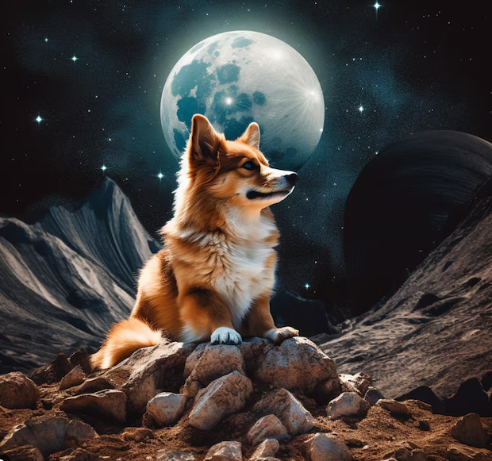
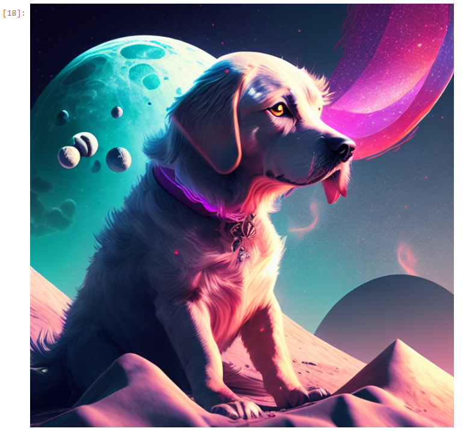

# IMATOR
Developed a cutting-edge text-to-image generator utilizing deep learning algorithms to convert textual descriptions into high-quality images, revolutionizing content creation and visual storytelling.
# Overview

<iframe width="560" height="315" src="https://www.youtube.com/embed/your_video_id" frameborder="0" allowfullscreen></iframe>

# Model Result 

#

#

#

